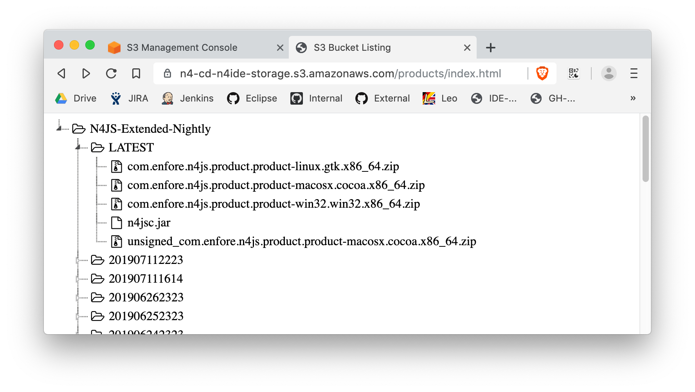

= Browse Contents of AWS S3 Buckets

This is a stand-alone `index.html` file that enables browsing of S3-Buckets of AWS using a navigation tree (jsTree).
Precondition is that the S3 Bucket is accessable.
The parent folder of the `index.html` is the root folder of the navigation tree.
File size and last modification time are displayed as tool tip text when hovering over a file name.

== Usage

Place the `index.html` into the S3 folder which you like to be the root folder of the navigation tree.
Set access permissions of that root folder in S3 Management Console (see below).
Test it by browsing to the `index.html`:
The URL should be like `www.BUCKET_NAME.s3.amazonaws.com/[PATH/]index.html`.

== AWS S3 Permissions

There are different ways of granting access to S3 Bucket.
The one described here uses bucket policies.
In the S3 Management console, navigate to your S3 Bucket root, click on _Permissions_ and chose _Bucket Policy_.
In the editor below, create two new entries:
 first to give read access for downloading files,
 and second to give list permissinos to read the directory structure of the bucket.
The example below shows these two entries.
Mind that you would need to replace the placeholders `BUCKET_NAME` and `PATH` appropriately.
In the screenshot above, the bucket name is `n4-cd-n4ide-storage` and the path is `products/`.

.Settings in _Bucket policy editor_
[source,json]
----
{
    "Version": "2012-10-17",
    "Id": "SomePolicyID",
    "Statement": [
        {
            "Sid": "Public-Access-To-S3-List",
            "Effect": "Allow",
            "Principal": "*",
            "Action": "s3:ListBucket",
            "Resource": "arn:aws:s3:::BUCKET_NAME",
            "Condition": {
                "StringLike": {
                    "s3:prefix": [
                        "PATH/*"
                    ]
                }
            }
        },
        {
            "Sid": "Public-Access-To-S3-Download",
            "Effect": "Allow",
            "Principal": "*",
            "Action": "s3:GetObject",
            "Resource": "arn:aws:s3:::BUCKET_NAME/PATH/*"
        }
    ]
}
----
